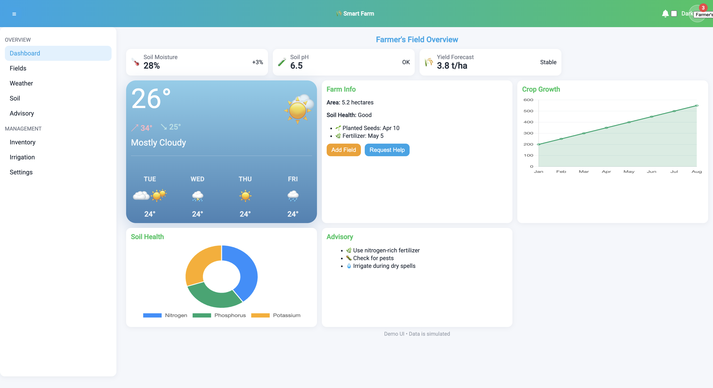
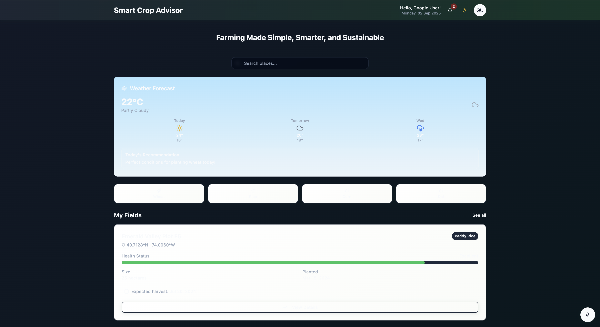
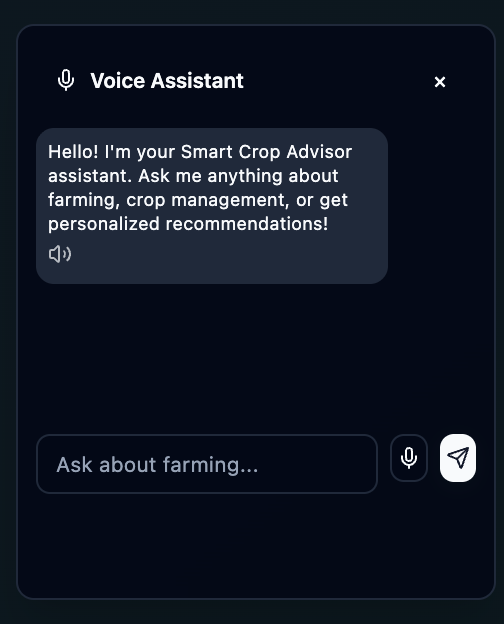

# 🌾 Yield Pro Advisor – Smart Agriculture Dashboard


---

## 📌 Overview

Yield Pro Advisor is a smart agriculture dashboard designed to help farmers and agricultural professionals efficiently manage their fields, monitor weather conditions, and make data-driven decisions. The platform provides a clean, responsive, and intuitive interface to simplify farming operations.

---

## 🚀 Features

* 🌱 Field Management Dashboard
* 🌦️ Weather Monitoring System
* 📊 Data Visualization & Insights
* 🔔 Notification System
* 👤 User Profile Management
* 🎙️ Voice Assistant Integration
* 📱 Fully Responsive Design

---

## 🛠️ Tech Stack

* **Frontend:** React, Vite, TypeScript
* **Styling:** Tailwind CSS
* **Tools:** ESLint, PostCSS

---

## 📂 Project Structure

```
yield-pro-advisor/
 ├── public/
 ├── src/
 │    ├── components/
 │    ├── pages/
 │    ├── assets/
 │    └── hooks/
 ├── screenshots/
 ├── package.json
 ├── vite.config.ts
 └── README.md
```

---

## ▶️ Run Locally

Clone the project:

```
git clone https://github.com/Ishani-yadav/yield-pro-advisor.git
```

Go to project directory:

```
cd yield-pro-advisor
```

Install dependencies:

```
npm install
```

Run the development server:

```
npm run dev
```

---

## 🌐 Live Demo

🚧 Coming Soon (Deployment in progress)

---

## 📸 Screenshots

### 🌾 Agriculture Overview


### 📊 Dashboard View



### 📈 Data Panel



### 🎙️ Voice Assistant



---

## 🎯 Learning Outcomes

* Built a scalable frontend using React and Vite
* Learned component-based architecture
* Improved UI/UX design skills
* Implemented responsive layouts using Tailwind CSS

---

## 🤝 Contributing

Contributions are welcome! Feel free to fork the repository and submit a pull request.

---

## 📜 License

This project is open-source and available under the MIT License.

---

## 👩‍💻 Author

**Ishani Yadav**
GitHub: https://github.com/Ishani-yadav
